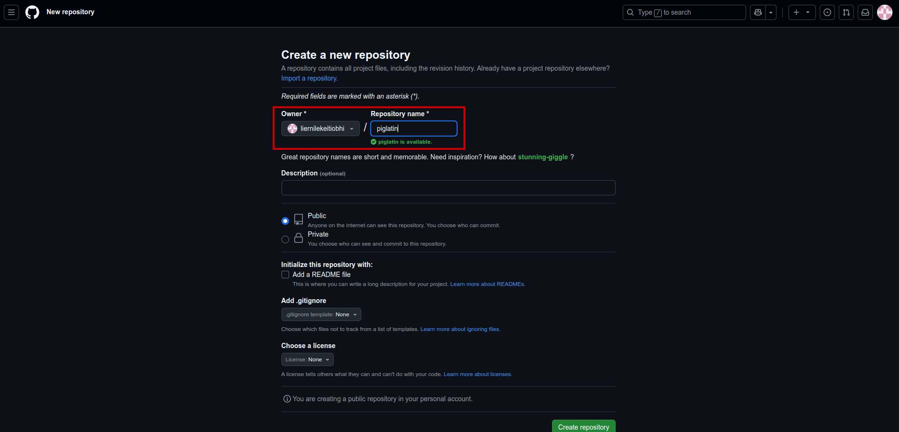
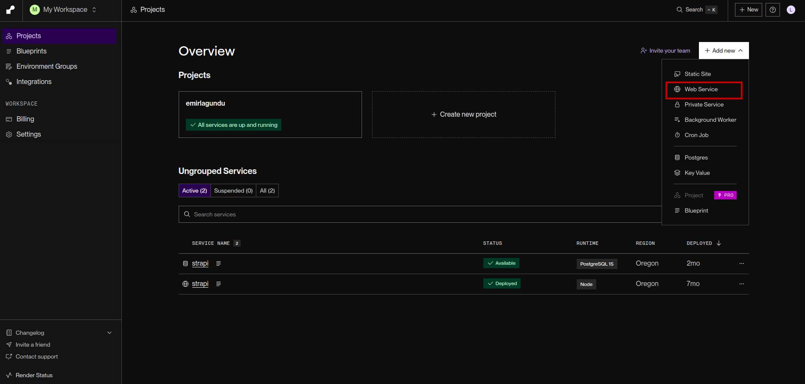
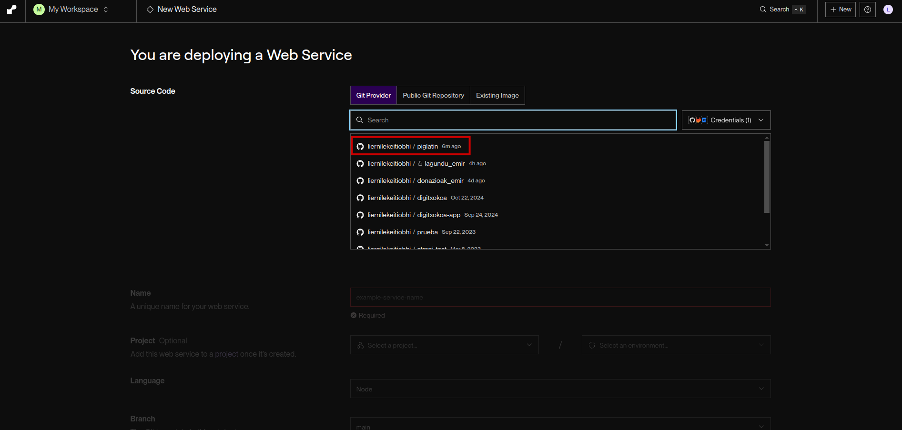

# 🐷 WEB APLIKAZIO BATEN SORRERA – Pig Latin Itzultzailea

Programa hau *Pig Latin* hizkuntzara esaldiak itzultzen dituen web aplikazio bat da. Aplikazioa Python-eko **Flask** web framework-arekin sortua dago eta ondorengo egitura du:

```
/templates
    index.html
/static
    /css
        style.css
    /js
        main.js
    /img
        pig.jpg
utils.py
app.py
```

---

## 💻 1. KODEA EDITATZEKO: VISUAL STUDIO CODE

Kodea idazteko eta fitxategiak kudeatzeko, **Visual Studio Code (VSC)** editorea erabiltzea gomendatzen da. Hau programa bat da, programatzaileek erabiltzen dutena beren kodea editatzeko.

Deskargatzeko:  
👉 [Visual Studio Code deskargatu](https://code.visualstudio.com/download)

VSC-ren ezker aldean zure proiektuaren karpeta ikusiko duzu. Bertan fitxategiak sor daitezke, adibidez `.py`, `.html`, `.js`, etab. Amaiera horiei esker, VSC-k jakiten du zein hizkuntza erabili.

---

## 🧪 2. FLASK PRESTATU ETA INSTALATU

**Flask** Python-en bidez web aplikazioak sortzeko erabiltzen den liburutegi (edo toolkit) bat da.

### 2.1. Terminala ireki

Visual Studio Code-en barruan, joan goiko menuan:  
> **Terminal → New Terminal**

### 2.2. Flask instalatu

Terminalean idatzi hau:

```
pip install flask
```

💡**Zer da `pip`?**  
*`pip` Python-en paketak instalatzeko tresna da*. Adibidez, Flask bezala kanpoko liburutegi bat zure ordenagailuan instalatzeko erabiltzen da.

---

## 🧠 3. KODEAREN AZALPENA

### Zer jakin behar dut hasieran?

1. **Zer da HTTP eskaera bat?**  
   Web nabigatzaileak zerbitzariari informazioa eskatzeko egiten duen komunikazioa da. Bi mota garrantzitsu daude:
   - `GET`: Informazioa eskuratzeko
   - `POST`: Informazioa bidaltzeko

2. **Zer da `fetch()`?**  
   JavaScript-en funtzio bat da, web zerbitzari bati eskaera bat egiteko (GET edo POST). Adibidez, esaldi bat zerbitzarira bidaltzeko eta erantzuna jasotzeko.

3. **Nola aldatzen dut HTML-a JavaScript-ekin?**  
   `document.getElementById()` edo `innerHTML` bezalako metodoekin, HTML barruko edukia alda dezakegu.


---

## 📂 FITXATEGIEN FUNTZIOA

### `app.py`

Web zerbitzaria martxan jartzen duen Python fitxategia da. Bi zeregin nagusi ditu:

1. Hasierako orria (`index.html`) erakusten du `/` helbidera sartzean.
2. Itzulpena kudeatzen du.
    2.1. Erabiltzaileak `POST` bidez `/translation` URL-ra bidaltzen dion esaldia jasotzen du.
    2.2. Esaldia Pig Latin hizkuntzara itzultzen du.
    2.3. Itzulpena bueltatzen dio erabiltzaileari.

### `index.html`

Erabiltzaileari erakusten zaion orrialdea da:

- Testu-kutxa bat du: esaldia sartzeko
- Botoi bat: esaldia bidaltzeko
- Itzulpena erakusteko `div` bat dauka (hasieran hutsik egongo da).

Hau beste bi fitxategirekin konektatuta dago:
- `style.css`: itxura
- `main.js`: funtzionamendua

### `style.css`

Orrialdearen estilo bisuala kontrolatzen du. Adibidez: letra-tipoak, koloreak, marjinak, irudia, etab.

### `main.js`

Erabiltzaileak botoia sakatzean gertatzen den guztia kontrolatzen du:

1. Esaldia jasotzen du HTML-etik
2. Zerbitzariari bidaltzen dio (fetch POST bidez)
3. Itzulpena jasotzen du
4. Itzulpena orrian bistaratzen du

### `utils.py`

Pig Latin itzultzeko logika hemen dago. Hau, `app.py` fitxategian ere jarri genezake, baina beste dokumentu batean edukiz `app.py` arinago geratzen da eta kodea hobeto antolatuta dago.

---

## 🚀 4. APLIKAZIOA LOKALEAN EXEKUTATU

Web aplikazioa zure ordenagailuan exekutatzeko (zure nabigatzailean probatzeko), terminalean honako komandoa idatzi:

```
flask --app app run
```

Honek zure aplikazioa martxan jarriko du helbide honetan (sartu URL hau nabigatzailean):  
👉 `http://127.0.0.1:5000`

---

## ☁️ 5. APLIKAZIOA INTERNETERA IGO (Render.com)

Zure aplikazioa interneten argitaratu nahi baduzu, **Render.com** plataforma erabili dezakezu (doakoa da proiektu bakarra izanez gero).

### Prestaketa (Renderrek Githubetik hartuko du kodea, beraz bertara igo behar dugu):

1. Sortu Git biltegia zure karpetan:

```
git init
```

2. Fitxategi guztiak gehitu:

```
git add .
```

3. Aldaketak gorde (commit egin):

```
git commit -m "Lehen bertsioa"
```

3. Sortu GitHub-en repositorio bat:




4. Gehitu GitHub-erako esteka lokalean dagoen git biltegiari:

```
git remote add origin <zure-GitHub-repositorioaren-URL-a>
```


5. Bidali fitxategiak GitHub-era:

```
git push -u origin main
```
Honek GitHubeko erabiltzailea eta pasahitza eskatuko dizkigu VSC-n.


Pasahitzerako, token bat sortu behar dugu GitHuben. 


Hemen tokenari izen bat jarri behar diogu, kadukatzeko data bat zehaztu eta token horrek emango dituen permisuak aukeratu. 
Nik inoiz kadukatzen ez den token bat daukat sortuta permisu guztiak dituena. Modu honetan, beti hori erabiltzen dut. 

Tokena ordenagailuan modu lokalean gorde. EZ PARTEKATU INOIZ SAREAN.


💡 **Oharra**: Hau lehen aldiz bakarrik egin behar da. Hurrengoetan nahikoa da:

```
git add .
git commit -m "egindako aldaketak"
git push
Username eta token sartu VSC-n
```

Programa lokalean martxan jarri badugu, `__pycache__` izeneko karpeta bat sortuko da automatikoki. Komeni da hau `git` biltegiak ez kontrolatzea. Horretarako, `.gitignore` izeneko karpeta bat sortuko dugu gure karpeta orokorraren barruan eta `__pycache__` bertan sartuko dugu.  Karpeta horretan dagoena `git`-ek saihestu egingo du eta `__pycache__` barrukoa ez da gitHube-ra igoko. 


### Render.com-en:

1. Kontua sortu.
2. GitHub kontua konektatu.

[Hemen](https://render.com/docs/deploy-flask)

Lehendabizi, Rederri bere zerbitzarian `flask` instalatu behar duela esan behar diogu. Horretarako gure karpetan `requirements.txt` izeneko artxibo bat sortuko dugu eta hau idatzi: 

```
# Flask Framework
Flask==1.0.2
```
Horrela, Rederrek badaki zer instalatu zerbitzarian. Hau, guk lokalean egin dugun `pip install flask` -en berdina egitea da, baina renderren zerbitzarian.

Ondoren, Renderren jarraitu:

Web service berri bat sortu. 

GitHub-eko dagokion repositoriora konektatu. 

Beste guztia horrela gelditu behar da:


---
